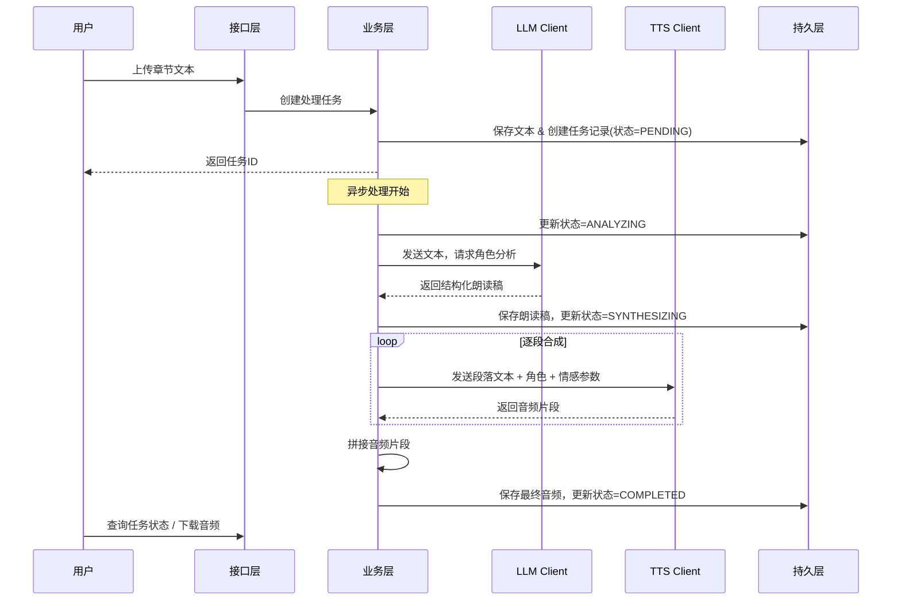
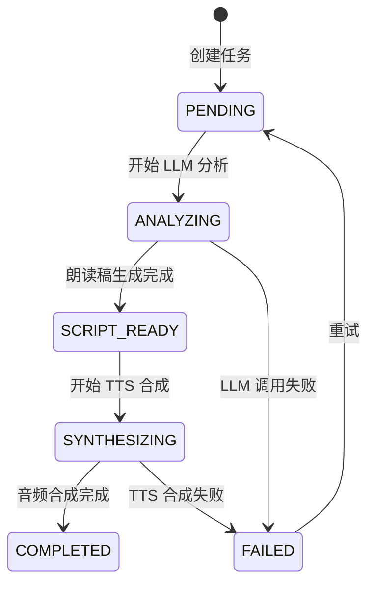

# VodiceBook 规格文档

> 小说转有声书平台 — 技术规格（MVP 阶段已实现，详见 [mvp.md](mvp.md)）

## 1. 系统架构概览

```
┌─────────────┐     ┌──────────────────────────────────────────┐     ┌─────────────┐
│             │     │            VodiceBook Server              │     │  External   │
│   Web UI    │────▶│                                          │────▶│  Services   │
│  (前端)     │◀────│  Controller ──▶ Service ──▶ Repository   │◀────│             │
│             │     │                   │                      │     │ SiliconFlow │
└─────────────┘     │              ┌────┴─────┐                │     │  QwenTTS    │
                    │              ▼          ▼                │     └─────────────┘
                    │         LLM Client  TTS Client           │
                    └──────────────────────────────────────────┘
```

### 1.1 分层架构

系统采用经典的分层架构，分为以下层次：

| 层次 | 职责 | 说明 |
|------|------|------|
| **展示层** | Web UI | 用户交互界面，上传文本、预览朗读稿、播放/下载音频 |
| **接口层** | REST Controller | 对外暴露 HTTP API，处理请求路由和参数校验 |
| **业务层** | Service | 核心业务逻辑编排，协调 LLM 分析和 TTS 合成的完整流程 |
| **集成层** | LLM Client / TTS Client | 封装与外部 AI 服务的交互，负责 API 调用、重试、错误处理 |
| **持久层** | Repository | 数据存储，管理章节文本、朗读稿、音频文件及任务状态 |

### 1.2 核心处理流程



## 2. 模块详细规格

### 2.1 章节管理模块

#### 功能描述

管理用户上传的小说章节文本，提供文本存储、检索和基本校验功能。

#### 数据模型：Chapter

| 字段 | 类型 | 约束 | 说明 |
|------|------|------|------|
| id | Long | PK, 自增 | 章节唯一标识 |
| title | String | 非空, 最大128字符 | 章节标题 |
| content | Text | 非空 | 章节正文内容 |
| wordCount | Integer | 自动计算 | 字数统计 |
| createdAt | DateTime | 自动生成 | 创建时间 |
| updatedAt | DateTime | 自动更新 | 更新时间 |

#### 接口规格

| 接口 | 方法 | 路径 | 说明 |
|------|------|------|------|
| 上传章节 | POST | `/api/chapters` | 上传章节文本 |
| 获取章节 | GET | `/api/chapters/{id}` | 获取指定章节 |
| 章节列表 | GET | `/api/chapters` | 分页获取章节列表 |
| 删除章节 | DELETE | `/api/chapters/{id}` | 删除指定章节 |

---

### 2.2 朗读稿生成模块（LLM 层）

#### 功能描述

调用大语言模型分析小说文本，识别角色对话与旁白，标注情感信息，生成结构化的朗读稿。

#### 核心逻辑

1. **文本预处理**：对原始章节文本进行清洗（去除多余空行、特殊字符等）
2. **Prompt 构建**：将清洗后的文本嵌入预设的 Prompt 模板，指导 LLM 完成角色识别和情感分析
3. **LLM 调用**：通过 SiliconFlow API 发送请求，获取结构化分析结果
4. **结果解析**：将 LLM 返回的内容解析为标准的朗读稿数据结构
5. **后处理校验**：验证朗读稿完整性（是否覆盖了原文所有内容、角色标注是否合理）

#### 数据模型：ReadingScript（朗读稿）

```json
{
  "chapterId": 1,
  "title": "第一章 初入江湖",
  "characters": [
    {
      "id": "narrator",
      "name": "旁白",
      "voiceProfile": "narrator_default",
      "description": "叙述者"
    },
    {
      "id": "char_001",
      "name": "李逍遥",
      "voiceProfile": "young_male_01",
      "description": "青年男性，性格洒脱"
    },
    {
      "id": "char_002",
      "name": "赵灵儿",
      "voiceProfile": "young_female_01",
      "description": "少女，温柔内敛"
    }
  ],
  "segments": [
    {
      "index": 0,
      "type": "narration",
      "characterId": "narrator",
      "emotion": "neutral",
      "text": "夜幕降临，月光如水般洒在小镇的石板路上。"
    },
    {
      "index": 1,
      "type": "dialogue",
      "characterId": "char_001",
      "emotion": "curious",
      "text": "这位姑娘，你也是来参加比武招亲的吗？"
    },
    {
      "index": 2,
      "type": "narration",
      "characterId": "narrator",
      "emotion": "gentle",
      "text": "少女微微一笑，月光映在她清澈的眼眸中。"
    },
    {
      "index": 3,
      "type": "dialogue",
      "characterId": "char_002",
      "emotion": "shy",
      "text": "我……我只是路过。"
    }
  ]
}
```

#### 朗读稿字段说明

**characters（角色列表）**

| 字段 | 类型 | 说明 |
|------|------|------|
| id | String | 角色唯一标识，旁白固定为 `narrator` |
| name | String | 角色名称 |
| voiceProfile | String | 对应的 TTS 音色标识 |
| description | String | 角色特征简述，辅助选择音色 |

**segments（段落列表）**

| 字段 | 类型 | 可选值 | 说明 |
|------|------|--------|------|
| index | Integer | — | 段落序号，从0开始 |
| type | Enum | `narration` / `dialogue` | 旁白 或 对话 |
| characterId | String | — | 对应的角色ID |
| emotion | String | `neutral`/`happy`/`angry`/`sad`/`fearful`/`surprised`/`gentle`/`serious`/`curious`/`shy` | 情感标注 |
| text | String | — | 段落文本内容 |

#### LLM Prompt 设计要点

```
你是一位专业的有声书朗读稿编辑。请分析以下小说文本，完成以下任务：

1. 识别所有出现的角色（包括旁白/叙述者）
2. 将文本拆分为连续的段落，每个段落标注：
   - 类型：旁白(narration) 或 对话(dialogue)
   - 说话角色
   - 情感状态
3. 确保所有原文内容都被覆盖，不遗漏任何文字

请严格按照以下 JSON 格式输出：
{结构化格式定义}

小说文本：
{chapter_content}
```

#### LLM 集成配置

| 配置项 | 说明 | 默认值 |
|-------|------|--------|
| `llm.provider` | API 平台 | SiliconFlow |
| `llm.api-url` | API 端点 | `https://api.siliconflow.cn/v1/chat/completions` |
| `llm.api-key` | API 密钥 | 通过环境变量注入 |
| `llm.model` | 模型名称 | 待定（根据实际选型确定） |
| `llm.max-tokens` | 最大输出 token 数 | 4096 |
| `llm.temperature` | 温度参数 | 0.3（偏低以保证输出稳定性） |

---

### 2.3 语音合成模块（TTS 层）

#### 功能描述

根据朗读稿的段落列表，逐段调用 QwenTTS API 合成语音，并将多段音频拼接为完整的章节音频。

#### 核心逻辑

1. **读取朗读稿**：加载结构化朗读稿数据
2. **音色映射**：根据 `characterId` 查找对应的 TTS 音色参数
3. **逐段合成**：遍历 `segments`，对每段文本调用 QwenTTS API
   - 传入文本内容、音色参数、情感参数
    - 接收返回的音频 URL，下载 WAV 文件
4. **音频拼接**：使用 `javax.sound.sampled.AudioInputStream` 正确合并多段 WAV（处理文件头）
5. **输出**：最终输出 WAV 格式音频（后续可转码为 MP3）

#### 音色配置模型：VoiceProfile

| 字段 | 类型 | 说明 |
|------|------|------|
| id | String | 音色标识，与朗读稿中的 `voiceProfile` 对应 |
| name | String | 音色名称（如"青年男性01"） |
| ttsVoiceId | String | QwenTTS 对应的 voice 参数值 |
| category | Enum | `male` / `female` / `narrator` / `child` |
| description | String | 音色描述 |

#### TTS 集成配置

| 配置项 | 说明 | 实际值 |
|-------|------|--------|
| `tts.provider` | TTS 服务商 | 阿里云 DashScope |
| `tts.api-url` | API 端点 | `https://dashscope.aliyuncs.com/api/v1/services/aigc/multimodal-generation/generation` |
| `tts.api-key` | API 密钥 | 通过环境变量 `TTS_API_KEY` 注入 |
| `tts.model` | TTS 模型 | `qwen3-tts-flash` |
| `tts.output-format` | 输出音频格式 | `wav` |
| `tts.sample-rate` | 采样率 | 24000 |
| `tts.segment-pause-ms` | 段落间停顿(毫秒) | 500 |

---

### 2.4 任务管理模块

#### 功能描述

管理从文本上传到音频生成的完整任务生命周期，支持异步处理和状态查询。

#### 数据模型：Task

| 字段 | 类型 | 说明 |
|------|------|------|
| id | Long | PK, 任务唯一标识 |
| chapterId | Long | FK, 关联的章节 |
| status | Enum | 任务状态 |
| progress | Integer | 进度百分比 (0-100) |
| readingScriptJson | Text | 生成的朗读稿(JSON) |
| audioFilePath | String | 生成的音频文件存储路径 |
| errorMessage | String | 错误信息（失败时填充） |
| createdAt | DateTime | 任务创建时间 |
| completedAt | DateTime | 任务完成时间 |

#### 任务状态流转



#### 任务状态枚举

| 状态 | 说明 |
|------|------|
| `PENDING` | 等待处理 |
| `ANALYZING` | LLM 正在分析文本 |
| `SCRIPT_READY` | 朗读稿已生成，等待用户确认或自动进入合成 |
| `SYNTHESIZING` | TTS 语音合成中 |
| `COMPLETED` | 处理完成 |
| `FAILED` | 处理失败 |

#### 接口规格

| 接口 | 方法 | 路径 | 说明 |
|------|------|------|------|
| 创建任务 | POST | `/api/tasks` | 提交章节ID，创建处理任务 |
| 查询任务 | GET | `/api/tasks/{id}` | 查询任务状态和进度 |
| 任务列表 | GET | `/api/tasks` | 分页获取任务列表 |
| 获取朗读稿 | GET | `/api/tasks/{id}/script` | 获取任务生成的朗读稿 |
| 更新朗读稿 | PUT | `/api/tasks/{id}/script` | 用户修改朗读稿后提交 |
| 开始合成 | POST | `/api/tasks/{id}/synthesize` | 确认朗读稿后开始TTS合成 |
| 下载音频 | GET | `/api/tasks/{id}/audio` | 下载生成的音频文件 |
| 重试任务 | POST | `/api/tasks/{id}/retry` | 重试失败的任务 |

---

## 3. 错误处理策略

| 场景 | 处理方式 |
|------|---------|
| LLM API 调用超时 | 重试3次，间隔递增(1s, 3s, 5s) |
| LLM 返回非法 JSON | 重试，调整 Prompt 增加格式约束 |
| TTS API 单段合成失败 | 重试3次；若仍失败，跳过该段并记录 |
| 文本过长超出 LLM 上下文窗口 | 自动分块处理，每块不超过 3000 字，保证段落完整性 |
| API Key 余额不足 | 捕获 402/429 错误，通知用户 |

## 4. 文件存储规范

```
storage/
├── chapters/          # 章节原始文本
│   └── {chapterId}.txt
├── scripts/           # 朗读稿 JSON
│   └── {taskId}.json
└── audio/             # 生成的音频文件
    ├── segments/      # 音频片段（临时）
    │   └── {taskId}/
    │       ├── 000.wav
    │       ├── 001.wav
    │       └── ...
    └── output/        # 最终音频
         └── {taskId}.wav
```

## 5. 配置文件结构

```yaml
# application.yml（MVP 实际配置）
app:
  storage:
    base-path: ./storage

llm:
  api-url: https://api.siliconflow.cn/v1/chat/completions
  api-key: ${LLM_API_KEY}
  model: ${LLM_MODEL:Qwen/Qwen2.5-7B-Instruct}
  max-tokens: 4096
  temperature: 0.3
  timeout-seconds: 120

tts:
  api-url: ${TTS_API_URL:https://dashscope.aliyuncs.com/api/v1/services/aigc/multimodal-generation/generation}
  api-key: ${TTS_API_KEY}
  model: ${TTS_MODEL:qwen3-tts-flash}
  output-format: wav
  sample-rate: 24000
  segment-pause-ms: 500
```

**音色映射**（硬编码于 `TtsService.java`）：

| voiceProfile | QwenTTS 音色 |
|-------------|-------------|
| narrator_default | Ethan |
| young_male_01 | Ethan |
| young_female_01 | Cherry |
| mature_male_01 | Ethan |
| mature_female_01 | Serena |
| child_01 | Chelsie |

## 6. 技术选型（候选）

| 组件 | 技术选型 | 说明 |
|------|---------|------|
| 后端框架 | Spring Boot 3.2.5 (Java 21) | ✅ 已实现 |
| 构建工具 | Maven | ✅ 已实现 |
| 数据库 | H2 (文件模式) | MVP 阶段使用，后续迁移 MySQL |
| 异步处理 | Spring Async + 线程池 | ✅ 已实现 |
| 音频处理 | javax.sound.sampled | 纯 Java WAV 合并，无需 FFmpeg |
| 前端 | Thymeleaf + 原生 JS | ✅ 已实现 |
| HTTP Client | RestTemplate | ✅ 已实现 |
| JSON 处理 | Jackson | ✅ 已实现 |

## 7. 部署约束

- **服务器配置**：4核 CPU、4GB 内存
- **核心计算外包**：LLM 分析和 TTS 合成均通过外部 API 完成，服务器本身不承担大模型推理
- **本地资源消耗**：主要消耗在音频文件的临时存储和 Java 音频拼接操作
- **磁盘空间**：需预留音频文件的存储空间，建议至少 10GB

## 8. 后续迭代方向（Roadmap）

| 优先级 | 功能 | 说明 |
|--------|------|------|
| P1 | 批量章节处理 | 支持整本小说的多章节连续处理 |
| P1 | 音色库管理 | 可视化管理音色，支持试听和选择 |
| P2 | 角色音色绑定记忆 | 同一小说中相同角色自动复用音色设置 |
| P2 | 用户自定义音色 | 上传参考音频创建自定义音色 |
| P3 | 多语言支持 | 英文、日文等其他语言的小说处理 |
| P3 | 产品化包装 | 用户系统、套餐计费、多租户支持 |
